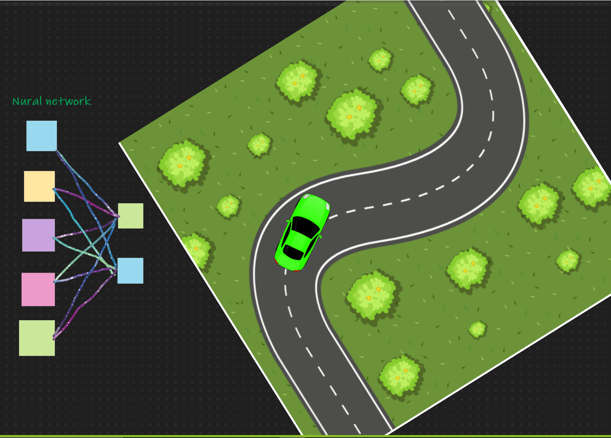
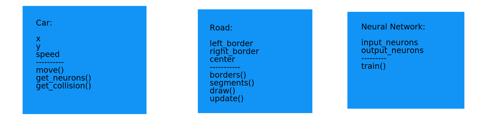

# self-driving-vehicle

**Group Members:**
  * Batool Malkawi.
  * Ahmad Walid Mohammad.
  * Sally Tareq.
  * Dana Kiswani.
  * Momayaz Aldous
  

**Title:** Self Driving Vehicle.

**Summary:** 
An app used to train a bot-vehicle to drive on its own.
Problem Domain:
-	In light of the technological advances we have seen within the road vehicles industry, we already see a demand for a self-driving vehicle. Motivated by the multitude of collisions we see on a day to day basis in Jordan, we found that a self-driving vehicle might add to safety of the population. With that in mind, the first step towards this is to first train a vehicle bot to recognize roads and avoid collision.

-	Use Cases: 
•	Autopilot mode in vehicles.
•	Increase safety.
     
**User Story Sentence:**
-	As a user, I want a vehicle that can detect road and drive by its own.
-	As a user, I want the vehicles to be able to avoid collisions in the road.

**Feature Tasks:**
-	Build the GUI.
-	Build an AI using genetic algorithm with several generations. Train the AI to drive the car on the map.
-	Build a random-generated road.
-	Define Neurons (number of neurons and type), and outputs of the Neural Network.
-	The model is trained on the random-generated road.
-	The model is tested for accuracy.

**Expected Challenges:**
-	Computational cost of training the model (vehicle).

**User Acceptance Tests:**
-	Input: vehicle, road – Output: vehicle finishes the road without collisions.

**Wireframe:**

**Domain Modeling: _not finalized_**

